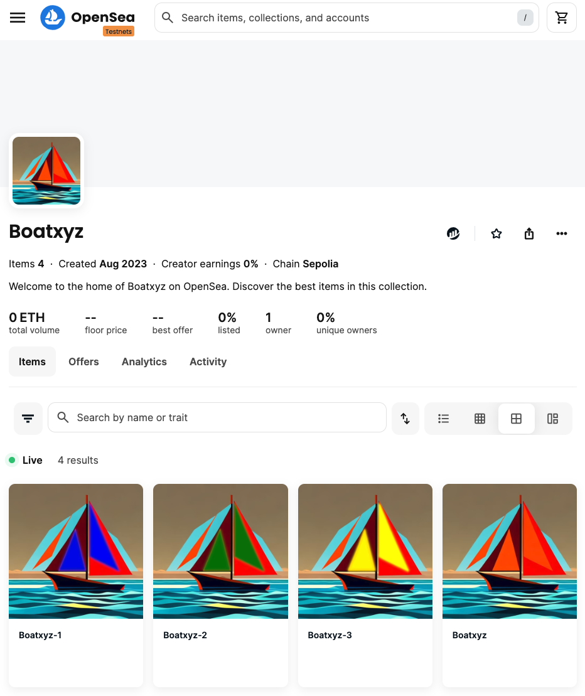

## 

# Introduction

A simple Project that aims at:

1. Developing an ERC721 Smart Contract with OpenZepplin
2. Deploying the NFT Smart Contract on Sepolia Testnet
3. Creating a simple NFT collection using Etherscan to Mint NFTs to be added to the collection

# Contract address on Sepolia

0xC6504b39865Fb3eCB55AD3aB89CAbb5293086BDc

# Link to the collection on OpenSea

https://testnets.opensea.io/collection/boatxyz

# Languages and Tools used

- Solidity
- Hardhat
- Etherscan
- OpenSea
- Filebase and IPFS

# Hardhat Project commands

This project demonstrates a basic Hardhat use case. It comes with a sample contract, a test for that contract, and a script that deploys that contract.

Try running some of the following tasks:

```shell
npx hardhat help
npx hardhat test
REPORT_GAS=true npx hardhat test
npx hardhat node
npx hardhat run scripts/deploy.js
```
